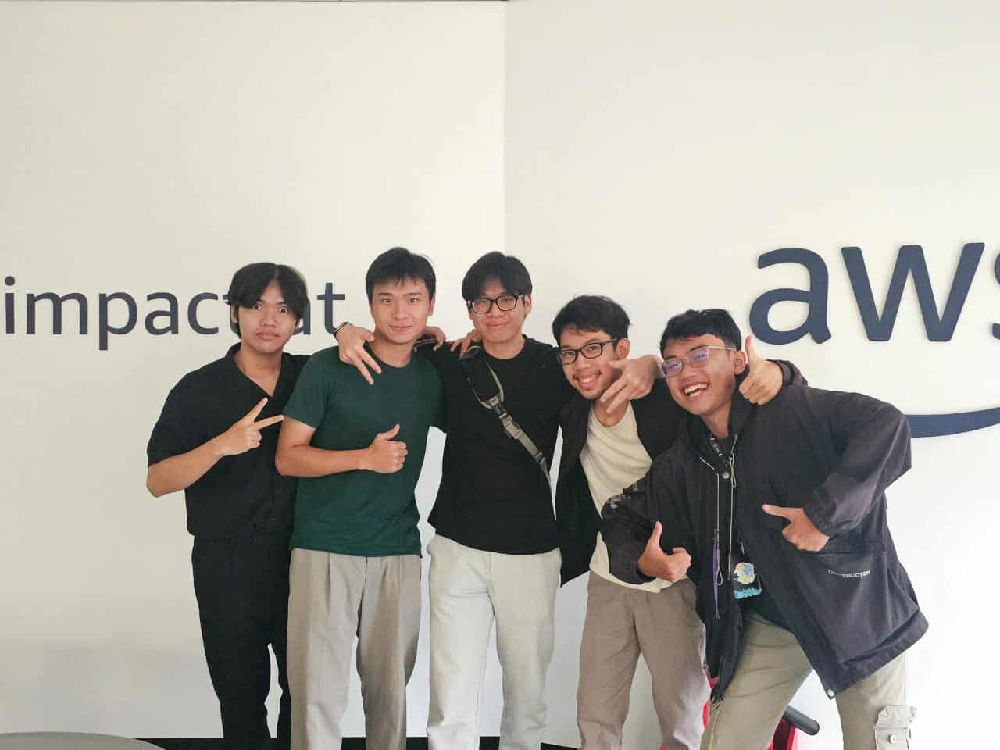

# Summary Report: “AI-Driven Development Life Cycle: Reimagining Software Engineering”

### Event Objectives

- Explore the transformative shift in software development driven by generative AI.
- Introduce the AI-Driven Development Life Cycle (AI-DLC) and its core concepts.
- Kiro and Amazon Q Developer demonstration

### Speakers

- **Toan Huynh** – Specialist SA, PACE
- **My Nguyen** - Sr. Prototyping Architect, Amazon Web Services - ASEAN

### Key Highlights

- Focused on the concept of AI-DLC, a framework where AI orchestrates the development process, including planning, task decomposition, and architectural suggestions, while developers retain ultimate responsibility for validation, decision-making, and oversight

**- AI-DLC Core Concept:** The approach is Human-Centric, with AI acting as a Collaborator to enhance developer capabilities, leading to Accelerated Delivery (cycles measured in hours/days instead of weeks/months) .

**- AI-DLC Workflow:** It's an iterative loop involving AI Tasks (Create plan, Implement Plan, Seek clarification) and Human Tasks (Provide clarification, Implement Plan), where the AI repeatedly asks clarifying questions and only implements solutions after human validation .

**- AI-DLC Stages:** The lifecycle is broken down into Inception, Construction, and Operation. Each stage builds richer context for the next:

+ Inception: Includes building context, elaborating intent with User Stories, and planning with Units of Work.

+ Construction: Involves Domain Modeling, code generation and testing, adding architectural components, and deploying with IaC & tests.

+ Operation: Focuses on deploying in production and managing incidents.

**- Challenges AI-DLC Aims to Solve:**

+ Scaling AI development: AI coding tools can fail with complex projects.

+ Limited control: Existing tools make it difficult to collaborate with and manage AI agents.

+ Code quality: Maintaining quality control when moving from proof-of-concept to production becomes difficult.

# Deep Dive: Kiro - The AI IDE for Prototype to Production

- Kiro, an AI-first Integrated Development Environment (IDE) that supports the AI-DLC, focusing on Spec-driven development

**- Spec-driven Development:** Kiro turns a high-level prompt (e.g., "I want to create a chat application like Slack") into clear requirements (requirements.md), system design (design.md), and discrete tasks (tasks.md), fundamentally shifting development from "vibe coding" to a structured, traceable process. Developers collaborate with Kiro on these specs, which serve as the source of truth.

**- Agentic Workflows:** Kiro's AI agents implement the spec while keeping the human developer in control, with the key features being:

**+ Implementation Plan:** Kiro generates a detailed Implementation Plan with start tasks, sub-tasks (e.g., "Implement user registration and login endpoints," "Implement JWT middleware"), and links them back to specific requirements for validation .

**+ Agent Hooks:** These delegate tasks to AI agents that trigger on events such as "file save." They autonomously execute in the background based on pre-defined prompts, helping to scale work by generating documentation, unit tests, or optimizing code performance.
### Key Takeaways
**- AI Ensures Production Readiness:** Kiro creating detailed design documents (like data flow diagrams and API contracts), and generating unit tests before the code is written, ensures that AI-generated code is production-ready and maintainable, not just a quick prototype.

**- Human Control via Artifacts:** Developers maintain control not by writing the bulk of the code, but by validating and refining the artifacts—the requirements, the design, and the task plan—before the AI agents execute the implementation.

### Applying to Work

**- Integrate Amazon Q Developer/Similar Tools:** Integrating AI coding assistants into my academic projects to automate boilerplate code and common tasks to boost productivity.

**- Focus on High-Value Tasks:** By letting AI automate undifferentiated heavy lifting, I can focus my time on mastering higher-value, creative tasks like Domain Modeling and Architectural Design, which are crucial human-centric activities in the Construction phase.  

### Event Experience

Attending the **AI-Driven Development Life Cycle: Reimagining Software Engineering** event provided a fascinating glimpse into the future of software development. It was clear that Generative AI isn't just a coding assistant; it's poised to become a core orchestrator of the entire development process. The session was well-structured, moving from the overarching concept of AI-DLC to specific demonstrations of Amazon Q Developer and Kiro. The demo of Kiro was particularly impactful, showing how a single text prompt can be transformed into a full, executable, and traceable development plan inside the IDE.

#### Lessons learned
- The three main challenges with current AI development (scaling, limited control, and code quality) made the structured, human-validated approach of AI-DLC seem highly necessary and well-thought-out.

#### Some event photos
